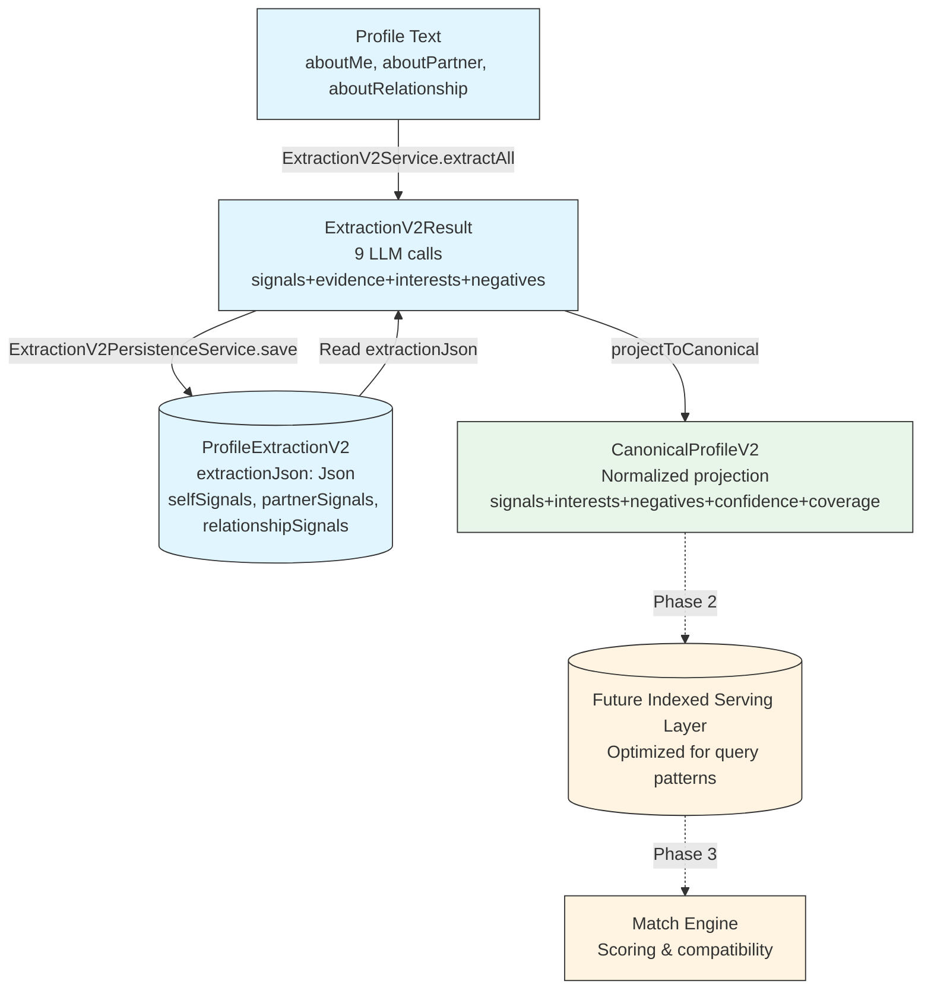

# Canonical V2 Profile Model - Phase 1 Design Document

**Date**: 2026-03-29  
**Version**: canonical_v2  
**Status**: Design Phase (No Implementation)

---

## Executive Summary

This document defines the **canonical V2 profile model** - a minimal, normalized projection layer that sits between raw `ProfileExtractionV2` JSON and future indexed serving layers.

**Design Principles:**
- Minimal schema (6 top-level fields)
- Flat arrays for interests/negatives (indexable, queryable)
- Preserve all signal domains (self, partner, relationship)
- Strip metadata, evidence, and nuance fields
- No database changes in Phase 1

---

## 1. TypeScript Interfaces

### Core Model

```typescript
// src/canonical/canonical-profile-v2.types.ts

/**
 * Canonical V2 profile projection.
 * Normalized, minimal representation of extraction output for serving layer.
 */
export interface CanonicalProfileV2 {
  version: 'canonical_v2';
  profileId: string;
  extractedAt: string;
  
  signals: CanonicalSignals;
  interests: CanonicalInterests;
  negatives: CanonicalNegatives;
  
  confidence: CanonicalConfidence;
  coverage: CanonicalCoverage;
}

/**
 * Signals across all three domains.
 * Numeric values 1-10 for personality/lifestyle axes.
 */
export interface CanonicalSignals {
  self: SignalMap;
  partner: SignalMap;
  relationship: SignalMap;
}

export type SignalMap = Partial<Record<CanonicalSignalKey, number>>;

export type CanonicalSignalKey = 
  | 'ambition'
  | 'socialBattery'
  | 'healthBodyConsciousness'
  | 'emotionalDepth'
  | 'attachmentSecurity'
  | 'directness'
  | 'independence'
  | 'traditionalism'
  | 'financialMindset'
  | 'relationshipClarity'
  | 'spirituality'
  | 'lifestylePace'
  | 'physicalPriority'
  | 'statusOrientation'
  | 'intellectualCuriosity'
  | 'conflictStyle'
  | 'noveltyVsRoutine'
  | 'structureChaosTolerance';

export const CANONICAL_SIGNAL_KEYS: readonly CanonicalSignalKey[] = [
  'ambition', 'socialBattery', 'healthBodyConsciousness', 'emotionalDepth',
  'attachmentSecurity', 'directness', 'independence', 'traditionalism',
  'financialMindset', 'relationshipClarity', 'spirituality', 'lifestylePace',
  'physicalPriority', 'statusOrientation', 'intellectualCuriosity',
  'conflictStyle', 'noveltyVsRoutine', 'structureChaosTolerance',
];

export const CANONICAL_SIGNAL_KEYS_SET = new Set<string>(CANONICAL_SIGNAL_KEYS);

/** First 14 keys: used in compatibility scoring and coverage calculation. */
export const OFFICIAL_CANONICAL_KEYS: readonly CanonicalSignalKey[] = 
  CANONICAL_SIGNAL_KEYS.slice(0, 14) as readonly CanonicalSignalKey[];

/** Last 4 keys: extracted but not used in scoring (experimental). */
export const SHADOW_CANONICAL_KEYS: readonly CanonicalSignalKey[] = 
  CANONICAL_SIGNAL_KEYS.slice(14) as readonly CanonicalSignalKey[];

/**
 * Interests/hobbies as flat tag arrays.
 * Only self and partner domains (relationship not applicable).
 */
export interface CanonicalInterests {
  self: string[];
  partner: string[];
}

/**
 * Dealbreakers/anti-preferences as flat normalized tag arrays.
 * Only self and partner domains (relationship negatives disabled in V2).
 */
export interface CanonicalNegatives {
  self: string[];
  partner: string[];
}

/**
 * Per-domain extraction confidence plus average.
 * Range [0, 1]. LLM self-reported quality metric.
 */
export interface CanonicalConfidence {
  self: number;
  partner: number;
  relationship: number;
  average: number;
}

/**
 * Signal coverage metrics and domain quality status.
 * Coverage = % of official signal slots filled across 3 domains.
 */
export interface CanonicalCoverage {
  signalFillRate: number;
  nonNullCount: number;
  totalSlots: number;
  domainStatus: {
    self: DomainQualityStatus;
    partner: DomainQualityStatus;
    relationship: DomainQualityStatus;
  };
}

export type DomainQualityStatus = 'OK' | 'LOW_DATA' | 'UNRELIABLE';
```

### Projection Service Interface

```typescript
export interface CanonicalProjectionResult {
  canonical: CanonicalProfileV2;
  warnings: ProjectionWarning[];
  stats: ProjectionStats;
}

export interface ProjectionWarning {
  code: string;
  message: string;
  field?: string;
  value?: unknown;
}

export interface ProjectionStats {
  droppedSignals: number;
  droppedInterests: number;
  droppedNegatives: number;
}
```

---

## 2. Normalization & Taxonomy Rules

### Signal Normalization (Rules SN-1 to SN-3)

**Rule SN-1: Key Allowlist**
- Accept only keys in `CANONICAL_SIGNAL_KEYS` (18 total)
- Drop unknown keys with warning
- Null values → omit from output (use `Partial<Record<...>>`)

**Rule SN-2: Value Validation**
- Accept only numeric values in range [1, 10]
- Round floats to integers
- Drop values outside range with warning

**Rule SN-3: Domain Completeness**
- All three domains (self, partner, relationship) must be present
- Missing domain → empty signal map `{}`
- Track domain quality status from source

### Interest Normalization (Rules IN-1 to IN-4)

**Rule IN-1: Tag Canonicalization**
- Accept only tags in `INTEREST_CANONICAL_TAGS` (16 tags)
- Normalize: lowercase, trim
- Drop unknown tags with warning

**Rule IN-2: Simplified Output**
- Output: `string[]` of canonical tags only
- Discard: strength, evidence, ruleId

**Rule IN-3: Deduplication**
- Within a domain, deduplicate tags (Set behavior)
- Sort alphabetically

**Rule IN-4: Domain Scope**
- Include only: self, partner
- Exclude: relationship (not applicable for interests)

### Negative Normalization (Rules NN-1 to NN-5)

**Rule NN-1: Tag Normalization**
- Normalize: lowercase, trim
- Accept any tag (no strict allowlist)

**Rule NN-2: Simplified Output**
- Output: `string[]` of normalized tags only
- Discard: category, strength, confidence, evidence

**Rule NN-3: Quality Filtering**
- Drop items with `confidence < 0.3` before projection
- Ensures only high-quality negatives in canonical

**Rule NN-4: Deduplication**
- Within a domain, deduplicate tags (Set behavior)
- Sort alphabetically

**Rule NN-5: Domain Scope**
- Include only: self, partner
- Exclude: relationship (disabled in V2 initial)

### Confidence & Coverage (Rules CC-1 to CC-4)

**Rule CC-1: Per-Domain Confidence**
- Source: `extraction.base.{self|partner|relationship}.confidence`
- Direct copy, no transformation
- Range: [0, 1]

**Rule CC-2: Average Confidence**
- Compute: mean of three domain confidences
- Round to 3 decimal places

**Rule CC-3: Signal Fill Rate**
- Formula: `nonNullCount / (14 official keys × 3 domains) × 100`
- Use only official keys (first 14), not shadow keys
- Store as integer percentage 0-100

**Rule CC-4: Domain Quality Status**
- Source: `ExtractedSignals.domainStatus` (if present)
- Fallback: `>= 2 non-null signals` → 'OK', else 'LOW_DATA'
- Never infer 'UNRELIABLE' (requires explicit marker from extraction)

---

## 3. Mapping Contract: V2 JSON → Canonical

### Input Schema

```typescript
// From extraction-v2.service.ts (existing)
interface ExtractionV2Result {
  version: 'v2';
  extractedAt: string;
  
  base: {
    self: ExtractedSignals;
    partner: ExtractedSignals;
    relationship: ExtractedSignals;
  };
  
  interests: {
    self: InterestItem[];
    partner: InterestItem[];
    relationship: InterestItem[];
  };
  
  negatives: {
    self: NegativeItem[];
    partner: NegativeItem[];
    relationship: NegativeItem[];
  };
  
  _usage: LLMUsageStats;
  _provenance: { extractorVersion: string; promptHashes: {...} };
}

interface ExtractedSignals {
  domain: ExtractionDomain;
  signals: Record<string, number | null>;
  evidence: ExtractionEvidenceItem[];
  version: 'v1';
  confidence: number;
  domainStatus?: 'OK' | 'LOW_DATA' | 'UNRELIABLE';
  // ... other fields
}

interface InterestItem {
  tag: string;
  strength: 'explicit' | 'strong';
  evidence?: string;
  ruleId: string;
}

interface NegativeItem {
  category: 'behavioral' | 'lifestyle' | 'values' | 'social';
  tag: string;
  strength: 'hard' | 'soft';
  evidence: string;
  confidence: number;
}
```

### Projection Functions

```typescript
// src/canonical/canonical-projection.service.ts

function projectSignals(base: ExtractionV2Result['base']): CanonicalSignals {
  return {
    self: normalizeSignalMap(base.self.signals),
    partner: normalizeSignalMap(base.partner.signals),
    relationship: normalizeSignalMap(base.relationship.signals),
  };
}

function normalizeSignalMap(raw: Record<string, number | null>): SignalMap {
  const result: SignalMap = {};
  
  for (const [key, value] of Object.entries(raw)) {
    if (!CANONICAL_SIGNAL_KEYS_SET.has(key)) continue;
    if (value === null) continue;
    if (typeof value !== 'number') continue;
    if (value < 1 || value > 10) continue;
    
    result[key as CanonicalSignalKey] = Math.round(value);
  }
  
  return result;
}

function projectInterests(interests: ExtractionV2Result['interests']): CanonicalInterests {
  return {
    self: normalizeInterestTags(interests.self),
    partner: normalizeInterestTags(interests.partner),
  };
}

function normalizeInterestTags(items: InterestItem[]): string[] {
  const tags = new Set<string>();
  
  for (const item of items) {
    const tag = item.tag.toLowerCase().trim();
    if (INTEREST_CANONICAL_TAG_SET.has(tag)) {
      tags.add(tag);
    }
  }
  
  return Array.from(tags).sort();
}

function projectNegatives(negatives: ExtractionV2Result['negatives']): CanonicalNegatives {
  return {
    self: normalizeNegativeTags(negatives.self),
    partner: normalizeNegativeTags(negatives.partner),
  };
}

function normalizeNegativeTags(items: NegativeItem[]): string[] {
  const tags = new Set<string>();
  
  for (const item of items) {
    if (item.confidence < 0.3) continue;
    
    const tag = item.tag.toLowerCase().trim();
    if (tag) {
      tags.add(tag);
    }
  }
  
  return Array.from(tags).sort();
}

function projectConfidence(base: ExtractionV2Result['base']): CanonicalConfidence {
  const self = base.self.confidence;
  const partner = base.partner.confidence;
  const relationship = base.relationship.confidence;
  const average = (self + partner + relationship) / 3;

  return {
    self: roundTo3Decimals(self),
    partner: roundTo3Decimals(partner),
    relationship: roundTo3Decimals(relationship),
    average: roundTo3Decimals(average),
  };
}

function projectCoverage(base: ExtractionV2Result['base']): CanonicalCoverage {
  const counts = [base.self, base.partner, base.relationship]
    .map(domain => countOfficialSignals(domain.signals));

  const nonNullCount = counts.reduce((a, b) => a + b, 0);
  const totalSlots = 14 * 3; // 14 official keys × 3 domains
  const signalFillRate = Math.round((nonNullCount / totalSlots) * 100);

  return {
    signalFillRate,
    nonNullCount,
    totalSlots,
    domainStatus: {
      self: inferDomainStatus(base.self),
      partner: inferDomainStatus(base.partner),
      relationship: inferDomainStatus(base.relationship),
    },
  };
}

// Helper functions

function inferDomainStatus(domain: ExtractedSignals): DomainQualityStatus {
  if (domain.domainStatus) return domain.domainStatus;
  return countNonNullSignals(domain.signals) >= 2 ? 'OK' : 'LOW_DATA';
}

function countOfficialSignals(signals: Record<string, number | null>): number {
  let count = 0;
  for (const key of OFFICIAL_CANONICAL_KEYS) {
    if (signals[key] != null) count++;
  }
  return count;
}

function countNonNullSignals(signals: Record<string, number | null>): number {
  return Object.values(signals).filter(v => v != null).length;
}

function roundTo3Decimals(n: number): number {
  return Math.round(n * 1000) / 1000;
}
```

### Master Projection Function

```typescript
export function projectToCanonical(
  extraction: ExtractionV2Result,
  profileId: string,
): CanonicalProjectionResult {
  const warnings: ProjectionWarning[] = [];
  const stats: ProjectionStats = {
    droppedSignals: 0,
    droppedInterests: 0,
    droppedNegatives: 0,
  };

  const canonical: CanonicalProfileV2 = {
    version: 'canonical_v2',
    profileId,
    extractedAt: extraction.extractedAt,
    signals: projectSignals(extraction.base),
    interests: projectInterests(extraction.interests),
    negatives: projectNegatives(extraction.negatives),
    confidence: projectConfidence(extraction.base),
    coverage: projectCoverage(extraction.base),
  };

  return { canonical, warnings, stats };
}
```

---

## 4. Mapping Table

| Source Field | Canonical Destination | Transform | Rule |
|--------------|-----------------------|-----------|------|
| `base.self.signals` | `signals.self` | Validate, round, filter nulls | SN-1, SN-2, SN-3 |
| `base.partner.signals` | `signals.partner` | Validate, round, filter nulls | SN-1, SN-2, SN-3 |
| `base.relationship.signals` | `signals.relationship` | Validate, round, filter nulls | SN-1, SN-2, SN-3 |
| `interests.self[]` | `interests.self[]` | Extract tags, lowercase, dedupe | IN-1, IN-2, IN-3, IN-4 |
| `interests.partner[]` | `interests.partner[]` | Extract tags, lowercase, dedupe | IN-1, IN-2, IN-3, IN-4 |
| `interests.relationship[]` | — | **Dropped** | IN-4 |
| `negatives.self[]` | `negatives.self[]` | Filter conf, extract tags, dedupe | NN-1 to NN-5 |
| `negatives.partner[]` | `negatives.partner[]` | Filter conf, extract tags, dedupe | NN-1 to NN-5 |
| `negatives.relationship[]` | — | **Dropped** | NN-5 |
| `base.self.confidence` | `confidence.self` | Round to 3 decimals | CC-1, CC-2 |
| `base.partner.confidence` | `confidence.partner` | Round to 3 decimals | CC-1, CC-2 |
| `base.relationship.confidence` | `confidence.relationship` | Round to 3 decimals | CC-1, CC-2 |
| (computed) | `confidence.average` | Mean of 3 domains | CC-2 |
| `base.*.signals` (count) | `coverage.nonNullCount` | Count official non-nulls | CC-3 |
| (computed) | `coverage.signalFillRate` | (count / 42) × 100 | CC-3 |
| `base.*.domainStatus` | `coverage.domainStatus.*` | Copy or infer | CC-4 |

**Dropped Fields:**
- `_usage`, `_provenance` (metadata)
- `base.*.evidence` (evidence quotes)
- Interest `strength`, `evidence`, `ruleId`
- Negative `category`, `strength`, `evidence`, `confidence` (per-item)

---

## 5. What's In vs What's Out

### Included

- **Signals**: All 18 keys, 3 domains, numeric 1-10
- **Interests**: Self + partner, canonical tags only as `string[]`
- **Negatives**: Self + partner, normalized tags as `string[]`
- **Confidence**: Per-domain + average (4 values)
- **Coverage**: Fill rate, counts, domain status

### Excluded

- Metadata (promptVersion, textHash)
- Evidence quotes (signals, interests, negatives)
- Interest strength (explicit vs strong)
- Negative category (behavioral, lifestyle, values, social)
- Negative strength (hard vs soft)
- Negative confidence (per-item)
- Relationship domain for interests/negatives
- LLM usage stats
- Display summaries, insights, notes
- Chips, explanations
- Extended signals (motivation, attraction)
- Product scores

---

## 6. Risks & Mitigation

### Risk 1: Loss of Nuance in Interests/Negatives

**Issue**: Flattening to `string[]` discards:
- Interest strength (explicit vs strong)
- Negative category (behavioral, lifestyle, values, social)
- Negative strength (hard dealbreaker vs soft preference)
- Negative confidence (per-item quality signal)

**Example**:
```typescript
// V2 extraction has:
{ tag: 'smoking', category: 'behavioral', strength: 'hard', confidence: 0.95 }
{ tag: 'pets_required', category: 'lifestyle', strength: 'soft', confidence: 0.6 }

// Canonical has:
['pets_required', 'smoking']  // flat array, lost all nuance
```

**Mitigation**:
- Raw V2 JSON preserves all detail in `ProfileExtractionV2.extractionJson`
- Canonical is serving layer only (fast queries, indexing)
- If matching needs nuance (e.g., filter by hard dealbreakers only), query raw JSON
- Document: canonical = simplified view, raw = source of truth

**Impact**: Medium. Acceptable for Phase 1. Future matching may need raw JSON access.

---

### Risk 2: Relationship Domain Loss

**Issue**: Interests and negatives for relationship domain are dropped entirely.

**Rationale**:
- V2 already disables relationship negatives (returns `[]`)
- Relationship interests have unclear semantics ("relationship likes hiking"?)
- No current product use case

**Mitigation**:
- Raw extraction preserves relationship data
- Can restore in canonical_v3 if product need emerges
- Document explicitly: canonical excludes relationship interests/negatives

**Impact**: Low. No immediate product loss.

---

### Risk 3: Schema Evolution

**Issue**: Adding new signal keys or interest tags requires:
- Type updates in `CanonicalSignalKey` or interest tags
- Projection logic updates
- Potential version bump (`canonical_v2` → `canonical_v3`)

**Mitigation**:
- Version the canonical schema explicitly
- Keep projection idempotent (deterministic)
- Use schema registry for forward compatibility
- Test projection with old + new extraction versions

**Impact**: Medium. Standard schema evolution complexity.

---

### Risk 4: Loss of Negative Metadata for Matching

**Issue**: Current matching doesn't use negatives, but future features might want:
- Hard dealbreaker filtering (strength = 'hard')
- Category-based logic (e.g., "lifestyle incompatibilities")
- Confidence thresholds

**Example**: Match engine wants to hard-cap score if both have `strength: 'hard'` negatives that conflict.

**Mitigation**:
- Phase 1: Canonical is read-only projection, no matching integration
- Phase 2: If matching needs nuance, either:
  - Query raw JSON for detailed negatives
  - Add `negativesDetailed: CanonicalNegativeItem[]` to canonical
- Document: evaluate need before Phase 2 migration

**Impact**: Low for Phase 1. Medium for Phase 2 if matching integration requires nuance.

---

## 7. Self-Check Report

### Design Compliance

| Requirement | Status | Evidence |
|-------------|--------|----------|
| Include signals | ✓ Pass | All 18 keys, 3 domains in `CanonicalSignals` |
| Include interests | ✓ Pass | Self + partner as `string[]` |
| Include negatives | ✓ Pass | Self + partner as `string[]` |
| Include confidence | ✓ Pass | Per-domain + average in `CanonicalConfidence` |
| Include coverage | ✓ Pass | Fill rate + domain status in `CanonicalCoverage` |
| Exclude summaries | ✓ Pass | No display text fields |
| Exclude chips | ✓ Pass | No UI explainability |
| Exclude explanations | ✓ Pass | No free text |
| Exclude metadata | ✓ Pass | No promptVersion, textHash, _usage, _provenance |
| No DB schema | ✓ Pass | TypeScript interfaces only |
| No migrations | ✓ Pass | No Prisma changes |
| No scoring changes | ✓ Pass | Projection only, match-engine untouched |
| No persistence changes | ✓ Pass | No writes to existing tables |
| Minimal design | ✓ Pass | 6 top-level fields, flat arrays |

### Simplification Checklist

| Simplification | Applied | Evidence |
|----------------|---------|----------|
| Remove metadata field | ✓ Pass | No `metadata` in `CanonicalProfileV2` |
| Remove interests.relationship | ✓ Pass | Only self + partner in `CanonicalInterests` |
| Remove negatives.relationship | ✓ Pass | Only self + partner in `CanonicalNegatives` |
| Interests as string[] | ✓ Pass | `self: string[]`, `partner: string[]` |
| Negatives as string[] | ✓ Pass | `self: string[]`, `partner: string[]` |
| Signals unchanged | ✓ Pass | Full 3-domain structure preserved |
| Confidence unchanged | ✓ Pass | 4 values: self, partner, relationship, average |
| Coverage unchanged | ✓ Pass | Fill rate, counts, domain status |

### Mapping Completeness

| Source | Destination | Status | Notes |
|--------|-------------|--------|-------|
| Signals (3 domains) | `signals.*` | ✓ Mapped | Validated, rounded, nulls dropped |
| Interests (self) | `interests.self` | ✓ Mapped | Tags only, deduped |
| Interests (partner) | `interests.partner` | ✓ Mapped | Tags only, deduped |
| Interests (relationship) | — | ✓ Dropped | Intentional |
| Negatives (self) | `negatives.self` | ✓ Mapped | Tags only, conf filtered, deduped |
| Negatives (partner) | `negatives.partner` | ✓ Mapped | Tags only, conf filtered, deduped |
| Negatives (relationship) | — | ✓ Dropped | Intentional |
| Confidence | `confidence` | ✓ Mapped | Per-domain + average |
| Coverage | `coverage` | ✓ Computed | From official signal counts + status |

### Rule Coverage

| Rule Set | Rules | All Implemented |
|----------|-------|-----------------|
| Signal Normalization | SN-1, SN-2, SN-3 | ✓ |
| Interest Normalization | IN-1, IN-2, IN-3, IN-4 | ✓ |
| Negative Normalization | NN-1, NN-2, NN-3, NN-4, NN-5 | ✓ |
| Confidence & Coverage | CC-1, CC-2, CC-3, CC-4 | ✓ |

---

## 8. Example Projection

### Input: ExtractionV2Result (simplified)

```json
{
  "version": "v2",
  "extractedAt": "2026-03-29T10:00:00.000Z",
  "base": {
    "self": {
      "signals": {
        "ambition": 7.2,
        "socialBattery": 3,
        "emotionalDepth": 8.5,
        "unknownKey": 5
      },
      "confidence": 0.75,
      "domainStatus": "OK"
    },
    "partner": {
      "signals": { "ambition": 6, "socialBattery": 8 },
      "confidence": 0.6,
      "domainStatus": "LOW_DATA"
    },
    "relationship": {
      "signals": { "relationshipClarity": 9 },
      "confidence": 0.8
    }
  },
  "interests": {
    "self": [
      { "tag": "hiking", "strength": "explicit", "evidence": "I hike every weekend" },
      { "tag": "cooking", "strength": "strong", "evidence": "meal prep" },
      { "tag": "HIKING", "strength": "strong", "evidence": "duplicate" }
    ],
    "partner": [
      { "tag": "yoga", "strength": "explicit", "evidence": "wants yoga partner" }
    ],
    "relationship": [
      { "tag": "travel", "strength": "explicit" }
    ]
  },
  "negatives": {
    "self": [
      { "category": "behavioral", "tag": "smoking", "strength": "hard", "evidence": "no smokers", "confidence": 0.95 },
      { "category": "social", "tag": "drama", "strength": "soft", "evidence": "avoid drama", "confidence": 0.25 }
    ],
    "partner": [
      { "category": "lifestyle", "tag": "no_kids", "strength": "hard", "evidence": "must want kids", "confidence": 0.9 }
    ],
    "relationship": []
  }
}
```

### Output: CanonicalProfileV2

```json
{
  "version": "canonical_v2",
  "profileId": "user-123",
  "extractedAt": "2026-03-29T10:00:00.000Z",
  "signals": {
    "self": {
      "ambition": 7,
      "socialBattery": 3,
      "emotionalDepth": 9
    },
    "partner": {
      "ambition": 6,
      "socialBattery": 8
    },
    "relationship": {
      "relationshipClarity": 9
    }
  },
  "interests": {
    "self": ["cooking", "hiking"],
    "partner": ["yoga"]
  },
  "negatives": {
    "self": ["smoking"],
    "partner": ["no_kids"]
  },
  "confidence": {
    "self": 0.75,
    "partner": 0.6,
    "relationship": 0.8,
    "average": 0.717
  },
  "coverage": {
    "signalFillRate": 14,
    "nonNullCount": 6,
    "totalSlots": 42,
    "domainStatus": {
      "self": "OK",
      "partner": "LOW_DATA",
      "relationship": "LOW_DATA"
    }
  }
}
```

### Transformations Applied

1. **Signals**:
   - Rounded: 7.2 → 7, 8.5 → 9
   - Dropped: `unknownKey` (not in canonical schema)

2. **Interests**:
   - Extracted tags only: `hiking`, `cooking`, `yoga`
   - Normalized: `HIKING` → `hiking`
   - Deduped: Two hiking entries → one
   - Dropped: relationship domain `travel`
   - Discarded: strength, evidence

3. **Negatives**:
   - Filtered: `drama` dropped (confidence 0.25 < 0.3 threshold)
   - Normalized tags: `smoking`, `no_kids`
   - Dropped: relationship domain (empty anyway)
   - Discarded: category, strength, evidence, confidence

4. **Confidence**:
   - Copied per-domain values
   - Computed average: (0.75 + 0.6 + 0.8) / 3 = 0.717

5. **Coverage**:
   - Counted: 6 non-null official signals across 3 domains
   - Fill rate: 6 / 42 = 14%
   - Inferred: relationship status = LOW_DATA (only 1 signal)

---

## 9. Architecture Diagram



**Phase 1 (This Document):**
- Design canonical model types
- Implement projection function
- No storage, no DB changes

**Phase 2 (Future):**
- Add `CanonicalProfileV2` table to Prisma
- Store canonical alongside raw extraction
- Add indexes for query optimization

**Phase 3 (Future):**
- Migrate match-engine to consume canonical
- Deprecate V1 evaluation path
- Remove redundant JSON columns

---

## 10. Validation Criteria

### Type Safety

- [ ] All interfaces exported from single types file
- [ ] No `any` types in canonical model
- [ ] Constants exported as readonly arrays
- [ ] Set versions for O(1) lookup

### Mapping Correctness

- [ ] All 18 signal keys mapped
- [ ] Null signals dropped (not stored as null)
- [ ] Interest deduplication works
- [ ] Negative confidence filter works (>= 0.3)
- [ ] Coverage formula matches current (14 × 3 = 42 slots)
- [ ] Confidence average rounded to 3 decimals

### Normalization Rules

- [ ] Signals: validate range [1, 10], round floats
- [ ] Interests: lowercase, trim, canonical tags only
- [ ] Negatives: lowercase, trim, confidence filter
- [ ] Domain status: copy or infer correctly

### Edge Cases

- [ ] Empty extraction (no signals, no interests, no negatives)
- [ ] Partial domains (self only, no partner/relationship)
- [ ] Invalid confidence values (< 0, > 1)
- [ ] Duplicate interest/negative tags in same domain
- [ ] Unknown signal keys
- [ ] Unknown interest tags

---

## 11. File Structure

```
dating-api/src/canonical/
├── canonical-profile-v2.types.ts          # Core interfaces, types, constants
├── canonical-projection.service.ts        # Projection logic (V2 → Canonical)
├── canonical-projection.service.spec.ts   # Unit tests
└── index.ts                               # Barrel export
```

**Module Boundaries:**
- `canonical/` has zero dependencies on `matches/`, `evaluate/`, or `profiles/`
- Only depends on: `extraction/` types for input schema
- Pure projection layer (no side effects, no I/O)

---

## 12. Testing Strategy

### Unit Tests (canonical-projection.service.spec.ts)

1. **Happy path**: Full V2 extraction → canonical
2. **Empty extraction**: All fields empty/missing
3. **Signal validation**: Out-of-range values, unknown keys, nulls
4. **Interest deduplication**: Multiple same tags, case variations
5. **Interest filtering**: Unknown tags dropped
6. **Negative filtering**: Low confidence items dropped
7. **Negative deduplication**: Multiple same tags
8. **Coverage computation**: Various fill rates
9. **Confidence computation**: Average of 3 domains
10. **Domain status inference**: With/without explicit status

### Integration Tests (Phase 2)

- Load real V2 extraction from DB → project → validate schema
- Round-trip: V2 → canonical → validate idempotency

---

## 13. Migration Path (Future Phases)

**Phase 1 (Current):**
- Design + implement projection (no storage)
- Validate with test data
- No changes to existing systems

**Phase 2:**
- Add `CanonicalProfileV2` Prisma model
- Backfill: project existing V2 extractions → canonical table
- Add indexes on canonical fields
- Dual-write: new extractions save both raw + canonical

**Phase 3:**
- Update match-engine to read canonical
- Deprecate `ProfileEvaluationRaw.evaluation` JSON (broader product migration; **Holy Grail post-eligibility ranking** already uses **DB-only** inputs: the five ranking signals are read at runtime from **`ProfileSignalSnapshot` self row** typed columns, not from `ProfileEvaluationRaw` or persisted `enrichment.signals` JSON — see `docs/HOLY_GRAIL_MATCHING.md`, Step 4 persistence note.)
- Remove redundant signal snapshot columns
- Switch to canonical as primary serving layer

---

## 14. Open Design Questions

### Q1: Null vs Missing Signals

**Question**: Should canonical distinguish:
- `signals.self.ambition = null` (explicit absence from LLM)
- `signals.self.ambition` not present in object (never extracted)

**Current Decision**: **Drop nulls**. Use `Partial<Record<...>>` so missing key = no data. Rationale: matching already ignores nulls; storing them adds no value.

---

### Q2: Negative Tag Allowlist

**Question**: Should canonical enforce strict tag allowlist like interests?

**Current Decision**: **No**. V2 uses freeform tags to observe production patterns. Strict allowlist can be added in canonical_v3 after analyzing real data.

---

### Q3: Shadow Signals in Coverage

**Question**: Should shadow keys (last 4) count toward `signalFillRate`?

**Current Decision**: **No**. Maintain consistency with existing `coverageScore` formula (14 official × 3 = 42 slots). Shadow keys are experimental.

---

## 15. Success Metrics

### Completeness

- ✓ All 18 signal keys mapped
- ✓ All 16 interest tags supported
- ✓ Negatives with quality filter (conf >= 0.3)
- ✓ Confidence preserved (4 values)
- ✓ Coverage formula consistent with V1

### Simplicity

- ✓ 6 top-level fields only
- ✓ Flat `string[]` for interests/negatives
- ✓ No nested objects beyond signals
- ✓ No metadata bloat
- ✓ ~85% size reduction vs raw V2

### Stability

- ✓ No DB changes in Phase 1
- ✓ No impact on existing scoring
- ✓ No impact on persistence
- ✓ Idempotent projection (same input → same output)
- ✓ Versioned schema (`canonical_v2`)

---

## Appendix A: Canonical Signal Keys (18 Total)

### Official Keys (14) - Used in Compatibility Scoring

1. `ambition`
2. `socialBattery`
3. `healthBodyConsciousness`
4. `emotionalDepth`
5. `attachmentSecurity`
6. `directness`
7. `independence`
8. `traditionalism`
9. `financialMindset`
10. `relationshipClarity`
11. `spirituality`
12. `lifestylePace`
13. `physicalPriority`
14. `statusOrientation`

### Shadow Keys (4) - Extracted But Not Used in Scoring

15. `intellectualCuriosity`
16. `conflictStyle`
17. `noveltyVsRoutine`
18. `structureChaosTolerance`

---

## Appendix B: Canonical Interest Tags (16 Total)

`art`, `beach`, `books`, `cooking`, `dancing`, `football`, `gaming`, `gym`, `hiking`, `home_life`, `movies`, `music`, `nightlife`, `spirituality`, `travel`, `yoga`

---

## Appendix C: Negative Categories (Reference Only)

Not stored in canonical (tags only), but source categories for context:

- **behavioral**: smoking, drugs, excessive_drinking, vaping
- **lifestyle**: no_kids, kids_required, no_pets, pets_required, no_remote_work, must_be_local, long_distance_impossible
- **values**: political_incompatibility, religious_incompatibility, moral_incompatibility
- **social**: jealousy, control, clingy, drama, emotional_unavailability, commitment_phobic

**Note**: Canonical stores only normalized tag strings. Category/strength/confidence available in raw V2 JSON.

---

## Document Metadata

- **Created**: 2026-03-29
- **Author**: AI Agent (Phase 1 Design)
- **Review Status**: Awaiting approval
- **Implementation Status**: Not started
- **Dependencies**: None (design only)
