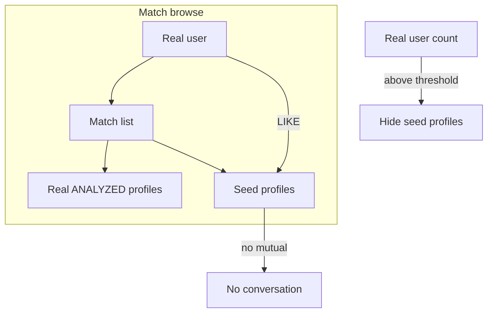

# Go-live seed profiles (planned)

**Status:** ⏸️ Parked — see [PARKED_GO_LIVE.md](./PARKED_GO_LIVE.md)  
**Audience:** Product / ops / engineering  
**Last updated:** 2026-08-07  
**Related:** [LAUNCH_COHORT_RUNBOOK.md](../sprints/sprint-09-product-mvp/LAUNCH_COHORT_RUNBOOK.md)

---

## Problem

On go-live, a new user who completes onboarding may see **zero matches** if there are not enough other `ANALYZED` profiles with approved photos in their gender/age cohort. That feels broken.

We need a **small seed base** so the first users always have someone to browse — without fake conversations or auto-replies.

---

## Decision (locked for v1 test)

| Topic | Decision |
|-------|----------|
| **Count (test)** | Start with **5** seed profiles; scale later if needed |
| **User experience** | Seed profiles appear in match browse like normal candidates |
| **LIKE / PASS** | Allowed |
| **Mutual match** | **Do not** create mutual matches with seed profiles |
| **Messaging** | **No auto-replies.** Block or fail gracefully if a user tries to message a seed |
| **Disclosure (UI)** | None for v1 test (backend-flagged only) — revisit before wider launch |
| **Fade-out** | Hide seed profiles automatically as real `ANALYZED` user density grows |
| **Explicitly out of scope** | AI chat personas, multi-day polite replies, “soft ghosting” scripts |

### Why no auto-chat

Undisclosed bots that reply like humans are the highest legal and reputational risk in dating apps (FTC actions, ICO fines, class actions). Browse-only seeds solve the empty-list problem with much lower risk.

---

## Target behavior

```text
User opens match list
  → sees real profiles + seed profiles (if pool is thin)
  → can swipe / like / pass on seeds
  → LIKE on seed: stored as action, no mutual match, no chat
  → real users join → seed profiles auto-hidden when threshold met
```



---

## What we have today (existing tooling)

| Asset | Purpose | Notes |
|-------|---------|-------|
| [`scripts/seed-mock-candidates.ts`](../../scripts/seed-mock-candidates.ts) | 2 mock `ANALYZED` candidates for a viewer | Good starting point; no photos, no `isMockProfile` flag |
| [`scripts/seed-qa50-pool.ts`](../../scripts/seed-qa50-pool.ts) | ~50 local QA profiles (`qa50_*`) | Local dev only; synthetic PNG portraits; **not for prod** |
| [LAUNCH_COHORT_RUNBOOK.md](../sprints/sprint-09-product-mvp/LAUNCH_COHORT_RUNBOOK.md) | Cohort checklist | Already mentions “seed N users per city” — this doc defines *how* |

**Gap:** No production seed system yet — no `isMockProfile` column, no admin create API, no fade-out job, no messaging guard.

---

## Implementation plan (next sprint)

### Phase 1 — Schema + backend flag

Add to `UserProfile` in Prisma:

```prisma
isMockProfile         Boolean   @default(false)
mockProfileCreatedBy  String?   // admin userId
mockProfileHiddenAt   DateTime?
```

Run migration before any prod seeds.

### Phase 2 — Create 5 test seeds (manual or admin script)

Each seed needs the same gates as a real candidate:

- `User` row (internal email pattern, e.g. `seed_[uuid]@internal.seed`)
- `UserProfile` with `isMockProfile: true`, `status: ANALYZED`
- ≥1 `UserProfilePhoto` with `status: APPROVED`
- `UserProfileEvaluation` JSON (for scoring / teasers)
- Realistic diversity: gender mix, ages, cities, holy-grail fields, prefs

**Photos:** Use licensed stock or your paid AI image tool (coffee shop, beach, home, street). Store in prod S3; approve in admin queue or pre-seed as `APPROVED` for seed-only workflow.

**Analysis:** Run real profile analysis pipeline once at creation (or inject evaluation JSON + signals if analysis is too slow for batch). Optional daily re-analysis cron only if copy changes — not required for static seeds.

### Phase 3 — Match list integration

In `MeMatchesService` candidate fetch:

1. Fetch real candidates (existing logic).
2. If count below threshold (e.g. `< 10`), supplement with visible seeds (`isMockProfile = true AND mockProfileHiddenAt IS NULL`).
3. Cap seed share (e.g. max 30% of page).

SQL filter addition:

```sql
AND (
  "isMockProfile" = false
  OR ("isMockProfile" = true AND "mockProfileHiddenAt" IS NULL)
)
```

### Phase 4 — Interaction guards

| Action | Behavior |
|--------|----------|
| LIKE seed | Allow; do **not** create `MutualMatch` |
| PASS seed | Allow |
| Message seed | Block with neutral copy (e.g. unavailable) |
| Report seed | Allow (ops can filter in admin) |

### Phase 5 — Fade-out

Cron (NestJS `@nestjs/schedule` or AWS EventBridge → Lambda):

- Count real `ANALYZED` profiles (optionally per city/gender).
- When count ≥ threshold (start with **50** real profiles, tune later), set `mockProfileHiddenAt = now()` on all seeds.
- Env: `SEED_PROFILE_FADE_OUT_ENABLED`, `SEED_PROFILE_MIN_REAL_USERS=50`.

### Phase 6 — Cleanup existing QA data

Before prod go-live:

- [ ] **Do not** deploy `qa50_*` profiles to production.
- [ ] Remove or hide any dev/test profiles not meant for users.
- [ ] Keep `qa50` script for local QA only.

---

## Go-live checklist (seed-specific)

- [ ] Migration: `isMockProfile` columns deployed
- [ ] 5 seed profiles created with approved photos + evaluations
- [ ] Test user in target city sees ≥1 match in list
- [ ] LIKE on seed does not open chat / mutual
- [ ] Fade-out threshold configured
- [ ] Analytics tag seed views/actions separately (`isMockProfile: true` in event props)
- [ ] Incident contacts filled in launch runbook §7

---

## Open product questions (decide before wider launch)

1. **UI disclosure** — badge “Example profile” vs fully hidden flag (legal review recommended).
2. **Geography** — seeds in one city only, or national pool?
3. **Threshold** — when to hide: 50 total users vs 20 per gender per city?
4. **Real user acquisition** — parallel plan: waitlist, invite wave, or single-city marketing (see runbook §2).

---

## What we decided NOT to do

- Auto-reply LLM pretending to be the seed person
- Multi-day conversation then polite ghosting
- Mutual match + fake chat threads
- Deploy undisclosed bots at scale before legal review

---

## References

- Match candidate gates: `MeMatchesService`, `matchCandidatePhotoEligibleWhere`
- Local mock script: `scripts/seed-mock-candidates.ts`
- Cohort ops: [LAUNCH_COHORT_RUNBOOK.md](../sprints/sprint-09-product-mvp/LAUNCH_COHORT_RUNBOOK.md)
- Content safety (prod): [Sprint 30 README](../sprints/sprint-30-content-safety/README.md) — DPA + 7-day notice before moderation go-live
