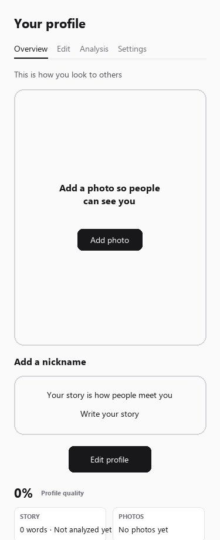
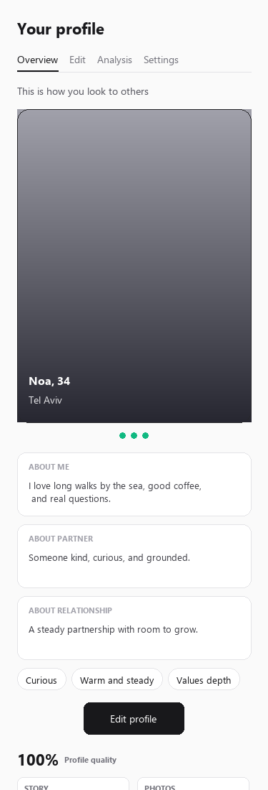

# Story 8: Redesign the profile overview

**Status:** Proposed
**Depends on:** Story 7

## Why

The overview today is a grey "Profile quality 10%" box, a row of tabs, and then a
large empty grey rectangle with a "?" in the corner where the photo should be. For a
new account that empty rectangle is most of the screen. It looks broken, it says
nothing about the person, and it gives no reason to care.

This is the page a user lands on after finishing sign-up. It should show them
something worth having.

## What

**As a** user
**I want** my profile page to show me what I actually look like to other people
**So that** I can tell whether it is any good and fix it if it is not

### The card

The page is the dating card itself, full bleed: primary photo, name, age and city
overlaid on it, the story rendered as real prose underneath, and analysis traits as
chips. One primary action: Edit. Framing copy: this is how you look to others.

### The status strip

Directly under the card, a compact row of four status items, each a link into its own
route from Story 07:

| Item | Shows | Links to |
|------|-------|----------|
| Story | word count, analyzed or not | `/profile/edit` |
| Photos | filled slots, review state | `/profile/edit#photos` |
| Matching | who and where you're open to | `/profile/settings` |
| Analysis | top traits, or "not run yet" | `/profile/analysis` |

The quality percentage folds into this strip. The separate grey meter box is deleted.

### Empty states — the point of the story

No state of this page may ever render a large empty grey box. With no photo, the card
shows a designed placeholder that names what is missing and links to fix it. With no
story, the prose area shows the same. An incomplete profile should look *unfinished
and fixable*, never broken.

### Acceptance criteria

- [ ] Overview renders as a photo-led card with name, age, city and story prose
- [ ] Analysis traits appear as chips when an evaluation exists
- [ ] The four-item status strip renders and every item routes correctly
- [ ] The standalone quality meter box is gone; the percentage lives in the strip
- [ ] A brand-new profile with no photo and no story renders a designed empty state — no grey rectangle, no bare "?"
- [ ] Works in `he` RTL and in dark mode
- [ ] Mobile layout checked at 375px

## Out of scope

- Changing what the quality percentage is calculated from
- Public profile pages as seen by other users

## Definition of done

- [x] Screenshot of the new overview at 0% and at 100% complete, both in the story
- [x] Nothing on the page resembles the current grey box

### Screenshots (375px layout reference)

**0% complete** (designed empties + status strip, no grey meter box):

**100% complete** (photo card, story prose, trait chips, strip):

